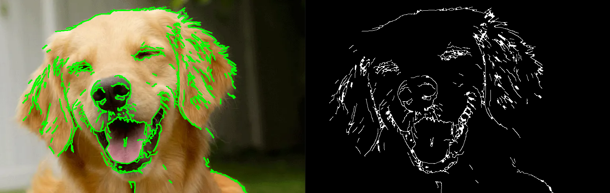

# Contour Detection Program Documentation

## Overview

This program is designed to detect and visualize contours in an image using the OpenCV library. Contours are essentially the boundaries of objects in an image. The program performs the following key steps:

### Preprocessing:

- Reads an image from a specified file path.
- Converts the image to grayscale to simplify further processing.
- Applies GaussianBlur to reduce noise in the image.

### Edge Detection:

- Applies Canny edge detection to identify significant changes in intensity and locate potential edges.

### Morphological Operations:

- Uses dilation and erosion to enhance the contours, making them more prominent and connected.

### Contour Finding:

- Applies the `cv2.findContours` function to identify contours in the processed image.
- Filters out small contours based on a specified minimum area threshold.

### Contour Approximation:

- Uses `cv2.approxPolyDP` to approximate each contour with a simpler polygon. This step helps in reducing the complexity of the contours.

### Drawing Contours:

- Draws the identified contours on the original image using the `cv2.drawContours` function.

### Displaying Results:

- Displays the original image, Canny edges, and the image with drawn contours for visual inspection.

### Output:

- Prints the number of contours found in the image.

## Usage

To use the program, simply call the `find_and_draw_contours` function with the file path of the image you want to process. For example:

```python
find_and_draw_contours('happy-pup-1.png')
```

##Parameters and Adjustments
-The Canny edge detection parameters (70 and 105) can be adjusted based on the specific characteristics of the input images.
-Morphological operations (dilation and erosion) iterations can be modified to fine-tune contour detection.
-The min_contour_area threshold is used to filter out small contours. Adjust this value based on the size of objects in your images.
-The epsilon value in the contour approximation step can be adjusted to control the level of simplification.

##Conclusion
This program is a basic template for contour detection in images. Feel free to experiment with the parameters and adjustments to achieve optimal results for your specific use case.


