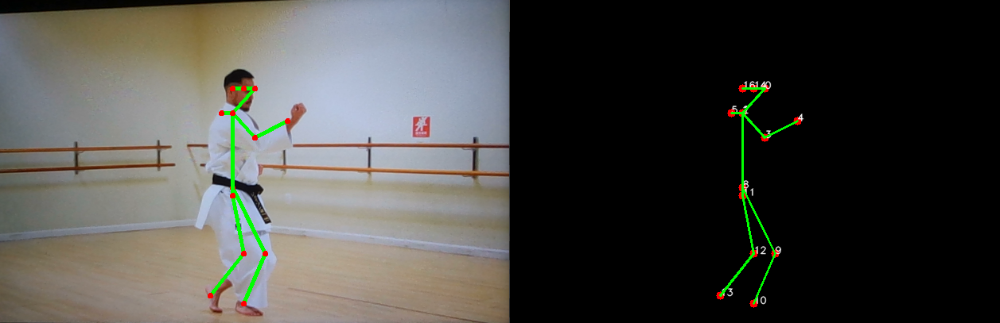

# Pose Detection Program Documentation

## Overview
This program performs pose detection using the OpenPose model and OpenCV. It captures video from a specified source, either a file or a camera, and overlays the estimated pose on the frames. The key steps of the program include:

### Configuration:
1. Define body parts indices and pose pairs for visualization.

### Input Processing:
2. Read input frames from a video file or camera.

### Pose Estimation:
3. Utilize OpenPose model for keypoint estimation on each frame.

### Visualization:
4. Draw the estimated pose on the frames using OpenCV functions.

### Displaying Results:
5. Display the main frame with the pose estimation and a secondary frame for detailed pose points.
